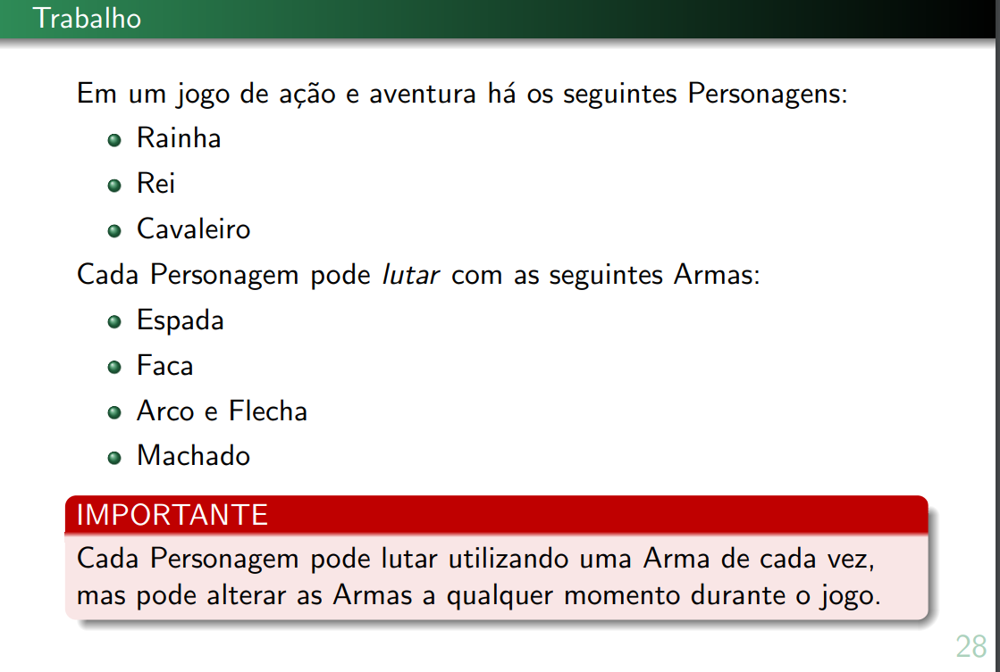
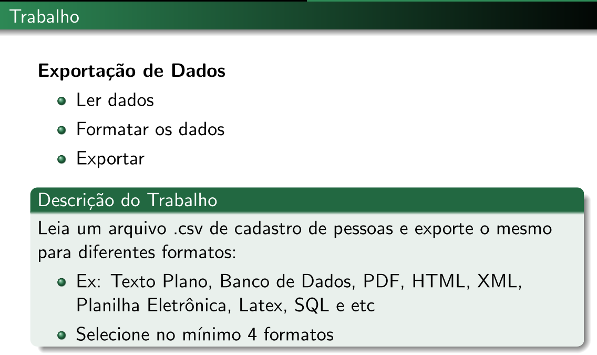
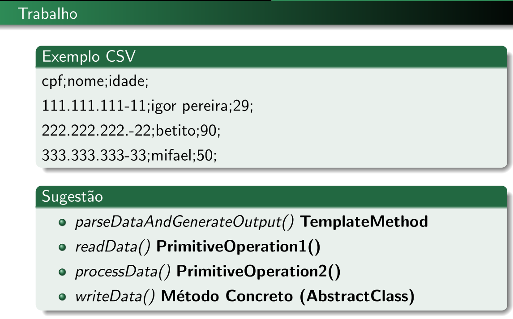
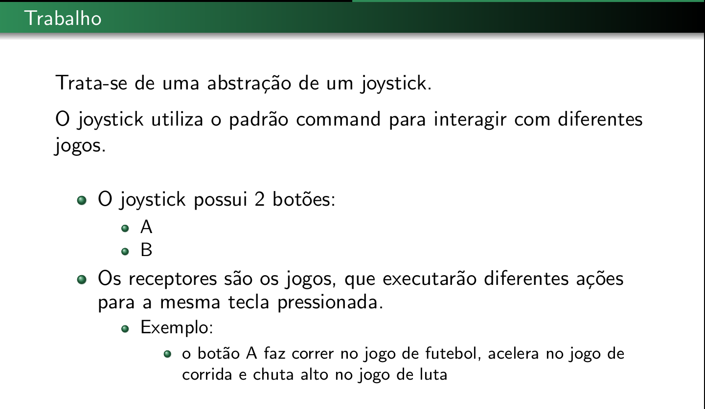

# Trabalho 1 - Strategy

Descrição do trabalho está nos últimos slides do padrão strategy



<!--
* [Slides](https://github.com/IgorAvilaPereira/ppp2024_2sem/raw/main/slides/01_strategy.pdf)

* [Vídeo](https://youtu.be/p_8G8EMuJxg)

**Prazo:** 23/08-->

**Valor:** 1

***

# Trabalho 2 - Observer

[Descrição](trab_observer.pdf)

[Vídeo](https://youtu.be/-O-PPbFYSxM)

<!--**Prazo:** 30/08-->

**Valor:** 1

<!--**Extra:** +0.5 (se for com interface gráfica)-->

***

# Trabalho 3 - Template Method





***

# Trabalho 4 - Command



[Vídeo](https://youtu.be/bKhafM8rieI)

<!--**Prazo:** 11/10-->

**Valor:** 1

***

# Trabalho 5 - State

[Vídeo](https://youtu.be/oCuHWQk4mPc)


**Valor:** 1


***

# Trabalho 6 - Decorator

Construa um gerador de documentos HTML.

Um documento HTML começa com um corpo básico:

```html
<html>
  <title> {TITULO} </title>
<body>
</body>
{CORPO}
</html>
```

Porém é possível incrementá-lo a fim de acrescentar novas tags como, por exemplo tabelas, quebras de linhas, links, botões, formulários, imagens e etc dentro do corpo do arquivo HTML.

Implemente o padrão Decorator para este problema. Construa, dinamicamente, o arquivo HTML e adicione, em tempo de execução, as demais tags HTML no corpo do arquivo. O processo de construção do arquivo HTML deverá ser semelhante ao trecho abaixo:

```java
Html html = new HTML("Titulo");
html = new Link(html, "Google", "http://www.google.com");
html = new Div(html);
// + tags html
html.build();
```
Construa no mínimo 5 tags html adicionais.

**Valor:** 1

**Desafio:** +0.5 Acrescentar tags aninhadas

***

# Trabalho 7 - Proxy

[Descrição](trab_proxy.pdf)

[Vídeo](https://youtu.be/TE4MdmVFf7I)

<!--**Prazo:** 15/11

**Valor:** 1-->

***